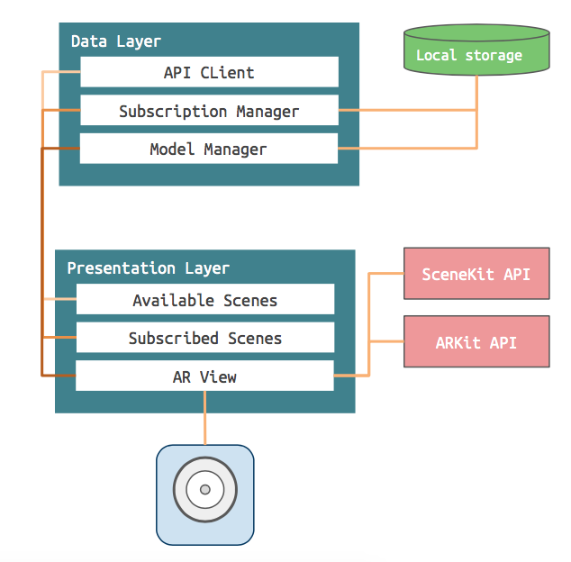

#  Digital Graffiti

Digital Graffiti is an AR experience that lets users place tags in their environment to display 3D models. When a user encounters a tag in the wild, this application allows one to view the 3D model associated with that tag in augmented reality.

# Architecture

The Digital Graffiti application consists of two layers the data and presentation layer.

## The Data Layer

The data layer handles fetching 3D assets from the web server, the storage of subscribed users and 3D assets on the device and loading assets into the ARView. It consists of the following:

- **APIClient** - Handles all communication with the web server. Includes methods to fetch the list of users and download asset files.

- **ModelManager** - Handles storing fetched assets to disk. Also handles loading assets and building SCNodes for the ARKit scene.

- **SubscriptionManager** - A singleton which acts as the local store. It contains a list of all subscribed users along with methods to subscribe/unsubscribe.

## The Presentation Layer

The presentation layer consists of 3 views:

- **AvailableView** - Displays a grid of cards showing the username and tag. When a card is clicked, the app subscribes to that user.

- **SubscriptionView** - Shows a table of all the tags a user subscribed to. From this view one may unsubscribe to a user. 

- **ARView** - Detects a tag in the wild and displays the associated model if the user subscribed to that tag.

# Acknowledgements

## Models

### Models taken from [Google Poly](https://poly.google.com/)

- [Butterfly](https://poly.google.com/view/e9NAQQrCbLu)
- [Earth](https://poly.google.com/view/0nEWYSdUqRq)
- [Android Robot](https://poly.google.com/view/9-bJ2cXrk8S)
- [Winter Island](https://poly.google.com/view/1a1z56n7u67)
- [Pikachu](https://poly.google.com/view/b8_ebRSSWFL)
- [Poketnave](https://poly.google.com/view/aOjoTXh5_eV)
- [Camera](https://poly.google.com/view/45rPLG4AL5W)
- [Dining car](https://poly.google.com/view/5teci4b6krG)
- [Attic fan](https://poly.google.com/view/3QSUtV4btiN)
- [carrinha](https://poly.google.com/view/0dBpFDxQOmu)

### Other
- [X-wing](https://github.com/iosdevzone/GettingStartedWithModelIO/tree/master/ModelIOApp/ModelIOApp)

## Icons

- Tab bar icons taken from Icons8 : [paint roller](https://icons8.com/icon/2021/paint-roller), [collage](https://icons8.com/icon/19297/collage) and [camera](https://icons8.com/icon/5376/camera)

## Other

- Special thanks to the iOS Developer Zone for their tutorial on how to use ModelIO. ([link](http://iosdeveloperzone.com/2016/05/10/getting-started-with-modelio/))
- Special thanks to Jordan Osterberg for his tutorial on how to combine ARKit and Vision. ([link](https://dev.to/osterbergjordan/arkit--vision-an-intriguing-combination))
